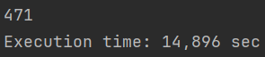

## [TASK](https://github.com/PeacockTeam/new-job/blob/master/lng-java.md)

### Run
1. Navigate to the project directory
2. Build the project using Maven:
```
mvn clean package
```
3. Run the jar file with the test file:
```
java -jar target/uno-soft-task-1.jar path-file.txt
```
---

